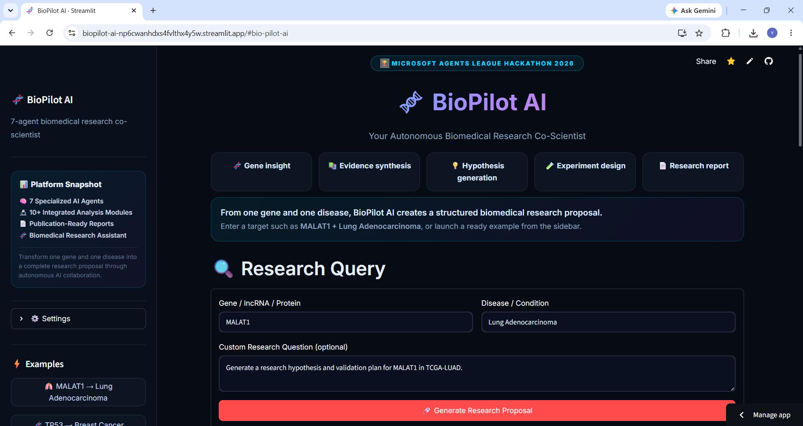
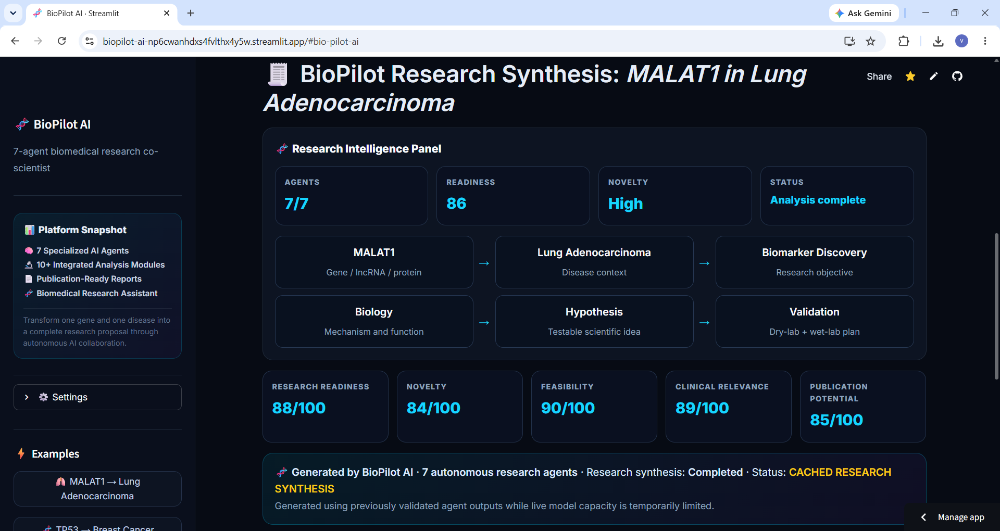
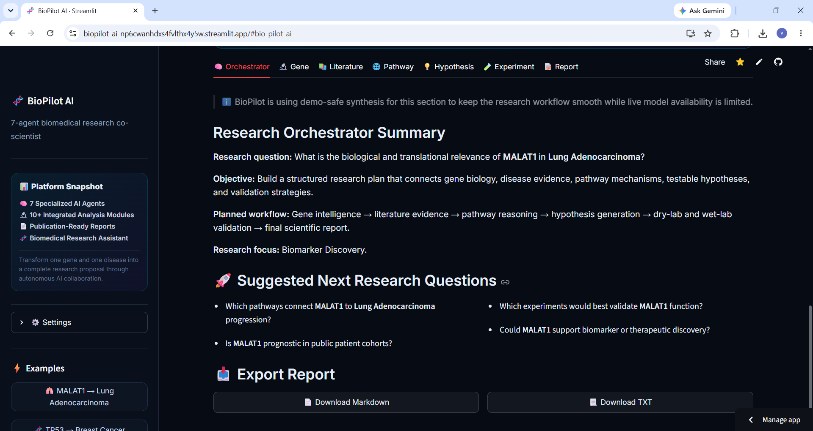

# 🧬 BioPilot AI

> **Autonomous Biomedical Research Co-Scientist**
>
> Transform a single **gene + disease query** into a complete biomedical research proposal using multiple AI agents.


---
#  Platform Preview

##  Home Interface



---

##  7-Agent Research Pipeline



---

## Generated Research Report



---

#  Overview

BioPilot AI is an autonomous multi-agent biomedical research platform designed to accelerate early-stage scientific discovery.

Instead of acting as a chatbot, BioPilot AI functions as an AI research collaborator capable of generating structured biomedical research proposals from a simple gene-disease query.

Example:

Gene:
MALAT1

Disease:
Lung Adenocarcinoma (LUAD)

↓

BioPilot AI generates:

- Gene intelligence
- Literature synthesis
- Pathway analysis
- Scientific hypotheses
- Experimental design
- Publication-ready research proposal

---

# Features

✅ Multi-agent AI architecture

✅ Gene intelligence analysis

✅ Literature evidence synthesis

✅ Biological pathway exploration

✅ Novel hypothesis generation

✅ Experimental design suggestions

✅ Publication-style research report

✅ Export reports

---

# 7-Agent Architecture

```

                 User Query
                      │
                      ▼
         🧠 Research Orchestrator
             ╱      │       ╲
            ▼       ▼        ▼
      🧬 Gene   📚 Literature  🌐 Pathway
             ╲      │       ╱
                  ▼
         💡 Hypothesis Generator
                  ▼
         🧪 Experimental Design
                  ▼
         📄 Report Generator

```

Each AI agent specializes in a different stage of biomedical research and collaborates to generate a comprehensive research proposal.

---

# Example Workflow

Input

Gene:
TP53

Disease:
Breast Cancer

↓

Output

- Biological function analysis
- Literature evidence
- Pathway interactions
- Novel hypotheses
- Experimental workflow
- Expected outcomes
- Future directions
- Publication-ready report

---

# 🛠 Technology Stack

- Python
- Streamlit
- Groq API
- Llama Models
- Markdown Report Generation
- Multi-Agent Prompt Engineering

---

# 🎯 Use Cases

- Biomedical research planning
- Biomarker discovery
- lncRNA research
- Cancer genomics
- Graduate students
- PhD researchers
- Research proposal generation
- Hypothesis generation

---

# ⚡ Running Locally

Clone repository

```bash
git clone https://github.com/YOUR_USERNAME/biopilot-ai.git
```

Move into project

```bash
cd biopilot-ai
```

Install dependencies

```bash
pip install -r requirements.txt
```

Run

```bash
streamlit run app.py
```

---

# 📈 Future Roadmap

- PubMed API integration
- GEO/TCGA dataset integration
- Protein structure analysis
- RAG-based literature retrieval
- Citation generation
- PDF export
- Multi-gene analysis
- Knowledge graph visualization

---

# 🏆 Built For

**Microsoft Agents League Hackathon 2026**

An autonomous AI platform designed to assist biomedical researchers through collaborative multi-agent reasoning.

---

# 👨‍💻 Author

**Vaishnavi Mangam**

Master's Student in Bioinformatics

Research interests:

- Cancer Genomics
- lncRNA Biology
- AI for Biomedical Research
- Multi-Agent Systems

---

# ⚠️ Disclaimer

BioPilot AI is intended for research and educational purposes only.

It does not provide medical diagnosis, clinical recommendations, or treatment advice.

All generated outputs should be independently validated by qualified researchers and domain experts.
